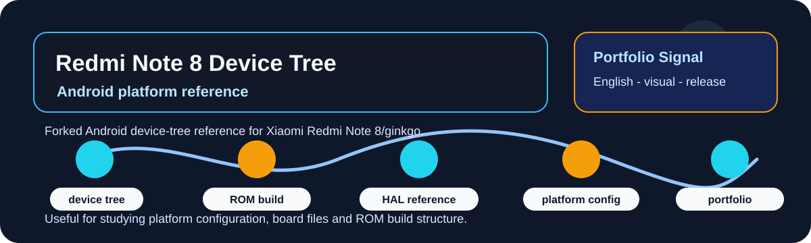

# Xiaomi Redmi Note 8 Android Device-Tree Fork Reference

  
  
  

  

## Overview

This fork is retained as historical study material for Android ROM builds, Xiaomi Redmi Note 8/ginkgo device-tree structure and platform configuration.

| Field | Details |
|---|---|
| Repository | [device_xiaomi_ginkgo-1](https://github.com/lhlizdabezt/device_xiaomi_ginkgo-1) |
| Portfolio category | Forked Android platform reference |
| Primary stack | Android device tree, ROM build workflow, hardware abstraction, platform configuration, Xiaomi Redmi Note 8/ginkgo. |
| Latest release | [GitHub Releases](https://github.com/lhlizdabezt/device_xiaomi_ginkgo-1/releases/latest) |
| Tags | [Version tags](https://github.com/lhlizdabezt/device_xiaomi_ginkgo-1/tags) |
| Owner profile | [Luong Hai Long](https://github.com/lhlizdabezt) |

## Reviewer Map

| What to Review | Where to Look | Why It Matters |
|---|---|---|
| Technical scope | This README and source tree | Gives a quick, bounded reading path before opening every file |
| Evidence assets | Release page and top-level project files | Shows what can be downloaded or inspected quickly |
| Implementation material | Source folders, scripts, notebooks or design files | Connects the portfolio claim to real project artifacts |
| Version history | Tags and release notes | Makes the repository easier to audit over time |

## Evidence Highlights

- Android device-tree reference for Xiaomi Redmi Note 8/ginkgo.
- ROM-build and hardware-abstraction study material.
- Platform-configuration context for Android development.
- Kept as forked reference material rather than original platform ownership.

## Repository Structure

| Path | Purpose |
|---|---|
| `configs/` | Top-level directory included in the repository |
| `fingerprint/` | Top-level directory included in the repository |
| `ifaa/` | Top-level directory included in the repository |
| `init/` | Top-level directory included in the repository |
| `overlay/` | Top-level directory included in the repository |
| `power/` | Top-level directory included in the repository |
| `rootdir/` | Top-level directory included in the repository |
| `sepolicy/` | Top-level directory included in the repository |

## Scope and Boundaries

Fork reference and historical Android-platform material. It is not presented as an actively maintained device bring-up project.

## Role and Portfolio Context

Luong Hai Long keeps this fork for Android platform study and portfolio completeness.

## Release and Tagging Notes

This repository is maintained as part of an English-facing engineering portfolio. Releases and tags are used to preserve reviewable snapshots of the project, including source state, documentation updates and any available visual or report assets.

## Writing Standard

The README follows an evidence-first style: direct technical nouns, clear project boundaries, release-backed artifacts and no inflated claims beyond what the repository can support.
